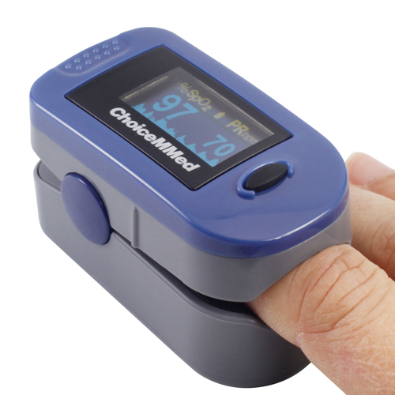

## What is "Doctor@Home"?

**Doctor@Home** (http://doctorathome.org) is a self-monitoring solution for stay-at-home patients with Covid-19 diagnosis. 
It consists of three key elements

1. **Monitoring at home**

	Optimize scarce resources for clinicians, and improves the quality of life for patients.
2. **Proactive Data collection**

	Accessible, pro-active data collection, that works particularly well for elderly people and with low-cost, unconnected devices.

3. **Intelligent Triaging**

	Machine Learning model for triaging supports clinicians in decision making. e.g. if a patient needs to be visited or even transferred into the hospital.

### Home Monitoring
Governments have started to hand out thousands of low-cost pulse oximeters to stay-at-home patients diagnosed with Covid-19. Clinicians, however, are expected to reach out to each patient at least three times a day to check vital parameters, such as blood oxygen saturation (SpO2). 
This approach would overload our healthcare systems, as we, unfortunately, anticipate the many thousands of infections coming up. Also, we can't really rely on patients to provide the responsible clinician with updates multiple times a day.

Our solution therefore proactively reaches out to patients by phone to gather health data frequently. Clinicians then work with a dashboard of their assigned patients. They get instant alerts when a triage level changes or when there are any other reasons to check back with the patient.

### Pulse Oximeters
Patients or authorized individuals can measure health parameters like blood oxygen saturation (SpO2), pulse, respiratory rate, and body temperature - non-invasive and in a safe environment. 

### Focus Group: Elderly People
The most vulnerable risk group for Covid-19 patients includes elderly patients. It is therefore crucial to design a system targeted to this group.  
Currently, we support calling the patient via phone and an interactive voice system. This has proven to work especially well for elderly people, as well as in scenarios of remote locations (rural villages, the alps) where there might be only landlines available.

### Summary
**Doctor@Home** supports clinicians to closely monitor their Covid-19 patients that are confined at home. The solution:

- Reduces workload from Clinicians and supports the medical triage
- Helps optimize scarce clinical resources while reducing infection exposure for patients and clinicians
- Improves patients quality of life by being able to stay home with their family as long as medically justifiable